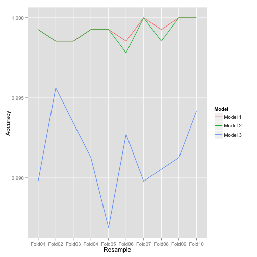
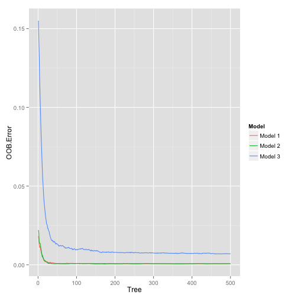

# Human Activity Recognition Analysis

This analysis is part of the programming assignment for the MOOC
[Practical Machine Learning](https://www.coursera.org/course/predmachlearn). It
uses the
[Weight Lifting Dataset](http://groupware.les.inf.puc-rio.br/work.jsf?p1=11201)
by E. Velloso, A. Bulling, H. Gellersen, W. Ugulino, and H. Fuks to predict the
quality of barbell lifts. The assignment consists of two parts:

1. this report that details the process of finding a model that predicts the quality of the exercise on a given training data set
2. prediction on a given testing data set of which we do not know the outcome

## Model Building Strategy

The grade of the second part of the assignment is based on the prediction success rate of our model on the testing data set. In order to achieve the highest grade we should find a model that is tuned perfectly on the test set - even if it is overfitted. So we decide against following the standard procedure of exploring only our training data and holding back the testing data until the end where we predict on it only once. On the other hand we still want to reduce overfitting as much as possible. Therefore we follow the following model building strategy:

1. minimal exploratory data analysis on the training and testing data sets
2. splitting of the training data set into a training and a testing partition
3. building several models with cross-validation against the training partition
4. evaluating the models against the testing partition
5. selecting a model based on its purpose

We choose to build our models using the random forests algorithm with 10-fold cross-validation.

## Loading, Subsetting and Splitting the Data

We start with downloading the training and testing data sets and loading both sets into R.


```r
download.file (
    "https://d396qusza40orc.cloudfront.net/predmachlearn/pml-training.csv",
    "pml-training.csv",
    "curl"
)
download.file (
    "https://d396qusza40orc.cloudfront.net/predmachlearn/pml-testing.csv",
    "pml-testing.csv",
    "curl"
)
training <- read.csv("pml-training.csv")
testing <- read.csv("pml-testing.csv")
```

## Exploratory Data Analysis

What are the dimensions of both data sets?


```r
data.frame (
    trainingDimensions = dim(training),
    testingDimensions  = dim(testing)
)
```

```
##   trainingDimensions testingDimensions
## 1              19622                20
## 2                160               160
```

Both sets have the same number of columns. Let's have a look if some of them are different.


```r
data.frame (
    notIntesting  = setdiff(names(training), names(testing)),
    notInTraining = setdiff(names(testing), names(training))
)
```

```
##   notIntesting notInTraining
## 1       classe    problem_id
```

The testing data set has no outcome variable but has an identifier column instead which we already expected. Now let's have a look at NA's. If we find fields that have lots of NA's in the testing data set it would be sensible to exclude these variables from our model.


```r
library(plyr)
naProptesting <- sapply(1:dim(testing)[2], function(x){mean(is.na(testing[, x]))})
count(data.frame(naProptesting), "naProptesting")
```

```
##   naProptesting freq
## 1             0   60
## 2             1  100
```

100 variables in the testing data set have no value at all. We don't want them in any of our models so we remove them from our training data set.


```r
trainingSubset <- training[, naProptesting < 1]
naPropTraining <- sapply(1:dim(trainingSubset)[2], function(x){mean(is.na(trainingSubset[, x]))})
count(data.frame(naPropTraining), "naPropTraining")
```

```
##   naPropTraining freq
## 1              0   60
```

Now all our training have no NA's left at all in either data set. Let's look at the first columns of the training data set.


```r
trainingSubset[1:10, 1:6]
```

```
##     X user_name raw_timestamp_part_1 raw_timestamp_part_2   cvtd_timestamp
## 1   1  carlitos           1323084231               788290 05/12/2011 11:23
## 2   2  carlitos           1323084231               808298 05/12/2011 11:23
## 3   3  carlitos           1323084231               820366 05/12/2011 11:23
## 4   4  carlitos           1323084232               120339 05/12/2011 11:23
## 5   5  carlitos           1323084232               196328 05/12/2011 11:23
## 6   6  carlitos           1323084232               304277 05/12/2011 11:23
## 7   7  carlitos           1323084232               368296 05/12/2011 11:23
## 8   8  carlitos           1323084232               440390 05/12/2011 11:23
## 9   9  carlitos           1323084232               484323 05/12/2011 11:23
## 10 10  carlitos           1323084232               484434 05/12/2011 11:23
##    new_window
## 1          no
## 2          no
## 3          no
## 4          no
## 5          no
## 6          no
## 7          no
## 8          no
## 9          no
## 10         no
```

The X column looks to be some kind of identifier or row number. Let's verify this by testing it for uniqueness and its range in both data sets.


```r
data.frame (
    data_set = c("training", "testing"),
    unique_x = c(length(unique(training$X)), length(unique(testing$X))),
    min_x    = c(min(unique(training$X)), min(unique(testing$X))),
    max_x    = c(max(unique(training$X)), max(unique(testing$X))),
    rows     = c(dim(training)[1], dim(testing)[1])
)
```

```
##   data_set unique_x min_x max_x  rows
## 1 training    19622     1 19622 19622
## 2  testing       20     1    20    20
```

This confirms our assumption so we decide to exclude the variable from all our models as well. But before we do that let's have a look at the user column. We want to know if both data sets cover the same users and how many training data we have per user.


```r
trainingUsers <- count(training, "user_name")
names(trainingUsers)[2] <- "training_records"
testingUsers <- count(testing, "user_name")
names(testingUsers)[2] <- "testing_records"
merge(trainingUsers, testingUsers)
```

```
##   user_name training_records testing_records
## 1    adelmo             3892               1
## 2  carlitos             3112               3
## 3   charles             3536               1
## 4    eurico             3070               4
## 5    jeremy             3402               8
## 6     pedro             2610               3
```

We have several thousand training observations per user in the testing data set. Using the user name in our model could therefore lead to overfitting. But as described above an overfitted model might be helpful for the second part of the assignment so we decide to keep the user name to include it in at least one of our models. For the same reason we decide to keep the time stamp columns.


```r
trainingFinal <- trainingSubset[, -1]
```

## Partitioning of the Training Data Set

Now we split our training data set into a "final" training and a testing data set. We call both sets partitions to emphasize their difference from the original data sets.


```r
library(caret)
seed <- 20141119
set.seed(seed)
trainPartInd <- createDataPartition(training$classe, p = 0.7, list = FALSE)
trainPart <- trainingFinal[trainPartInd, ]
testPart <- trainingFinal[-trainPartInd, ]
```

## Model Building

We build all our models with the random forests algorithm and use 10-fold cross-validation for each training. We try out three models that only differ in their predictors:

* _Model 1_: all non-outcome variables
* _Model 2_: all non-outcome variables except user name
* _Model 3_: all non-outcome variables except user name and timestamp/time window variables


```r
ctrl <- trainControl(method = "cv", number = 10)
set.seed(seed)
model1 <- train (
    classe ~ .,
    data = trainPart,
    method = "rf",
    trControl = ctrl
)
set.seed(seed)
model2 <- train (
    classe ~ . - user_name,
    data = trainPart,
    method = "rf",
    trControl = ctrl
)
set.seed(seed)
model3 <- train (
    classe ~ . - user_name - raw_timestamp_part_1 - raw_timestamp_part_2 - cvtd_timestamp - num_window,
    data = trainPart,
    method = "rf",
    trControl = ctrl
)
```

## Model Evaluation

We start by comparing the model accuracies of each cross-validation sample.


```r
library(ggplot2)
sampleAccuracies <- data.frame (
    Model = rep(c("Model 1", "Model 2", "Model 3"), each = 10),
    Resample = c(model1$resample$Resample, model2$resample$Resample, model3$resample$Resample),
    Accuracy = c(model1$resample$Accuracy, model2$resample$Accuracy, model3$resample$Accuracy)
)
ggplot(sampleAccuracies, aes(Resample, Accuracy, colour = Model)) + geom_line(aes(group = Model))
```

 

The first two models seem to work better than the third model as the highest accuracy of our third model lies below the highest accuracy of our first two models. For folds 6 and 8 the first model is even slightly more accurate than model two, but both models have folds with higher accuracies so that this doesn't matter.

Next let's take a look at the final models and compare their out-of-bag error rates per tree. As all models have been built with the same number of trees (500) per sample we can compare them in the same plot.


```r
modelErrors <- data.frame (
    Model = rep(c("Model 1", "Model 2", "Model 3"), each = 500),
    Tree = rep(1:500, 3),
    OOB.Error = c (
        model1$finalModel$err.rate[, 1],
        model2$finalModel$err.rate[, 1],
        model3$finalModel$err.rate[, 1]
    )
)
ggplot(modelErrors, aes(Tree, OOB.Error, colour = Model)) + geom_line()
```

 

Again the first two models are very close to each other and the third model has a slightly higher error. We will now analyze each model a bit more in depth to understand how well all the trees have been aggregated into a single model.

### Model 1 - Using All Predictors


```r
model1; model1$finalModel;
```

```
## Random Forest 
## 
## 13737 samples
##    58 predictor
##     5 classes: 'A', 'B', 'C', 'D', 'E' 
## 
## No pre-processing
## Resampling: Cross-Validated (10 fold) 
## 
## Summary of sample sizes: 12364, 12364, 12364, 12363, 12363, 12362, ... 
## 
## Resampling results across tuning parameters:
## 
##   mtry  Accuracy  Kappa  Accuracy SD  Kappa SD
##    2    1         1      4e-03        5e-03   
##   41    1         1      6e-04        8e-04   
##   80    1         1      1e-03        2e-03   
## 
## Accuracy was used to select the optimal model using  the largest value.
## The final value used for the model was mtry = 41.
```

```
## 
## Call:
##  randomForest(x = x, y = y, mtry = param$mtry) 
##                Type of random forest: classification
##                      Number of trees: 500
## No. of variables tried at each split: 41
## 
##         OOB estimate of  error rate: 0.07%
## Confusion matrix:
##      A    B    C    D    E class.error
## A 3906    0    0    0    0   0.0000000
## B    2 2656    0    0    0   0.0007524
## C    0    1 2395    0    0   0.0004174
## D    0    0    2 2247    3   0.0022202
## E    0    0    0    2 2523   0.0007921
```

With 99.9% our first model has a very high accuracy. Its out-of-bag error rate is 0.07% which is very good as well. However cross-validation and the out-of-bag error rate only help us to reduce bias but do not protect our model from overfitting. In order to analyze its predicting capabilities on a new data set we use it to predict our testing partition and build a confusion matrix on our prediction.


```r
confusionMatrix(predict(model1, newdata = testPart), testPart$classe)
```

```
## Confusion Matrix and Statistics
## 
##           Reference
## Prediction    A    B    C    D    E
##          A 1674    1    0    0    0
##          B    0 1138    2    0    0
##          C    0    0 1024    1    0
##          D    0    0    0  963    0
##          E    0    0    0    0 1082
## 
## Overall Statistics
##                                     
##                Accuracy : 0.999     
##                  95% CI : (0.998, 1)
##     No Information Rate : 0.284     
##     P-Value [Acc > NIR] : <2e-16    
##                                     
##                   Kappa : 0.999     
##  Mcnemar's Test P-Value : NA        
## 
## Statistics by Class:
## 
##                      Class: A Class: B Class: C Class: D Class: E
## Sensitivity             1.000    0.999    0.998    0.999    1.000
## Specificity             1.000    1.000    1.000    1.000    1.000
## Pos Pred Value          0.999    0.998    0.999    1.000    1.000
## Neg Pred Value          1.000    1.000    1.000    1.000    1.000
## Prevalence              0.284    0.194    0.174    0.164    0.184
## Detection Rate          0.284    0.193    0.174    0.164    0.184
## Detection Prevalence    0.285    0.194    0.174    0.164    0.184
## Balanced Accuracy       1.000    0.999    0.999    0.999    1.000
```

We still have a very high accuracy of 99,9%. Also the sensitivity and specificity of all classes are very close to 1 as well. Let's have a look at the most important variables in our model.


```r
varImp(model1)
```

```
## rf variable importance
## 
##   only 20 most important variables shown (out of 80)
## 
##                                Overall
## raw_timestamp_part_1            100.00
## num_window                       44.95
## roll_belt                        41.88
## pitch_forearm                    26.14
## magnet_dumbbell_z                18.60
## magnet_dumbbell_y                14.72
## pitch_belt                       12.05
## roll_forearm                     11.81
## yaw_belt                         11.74
## cvtd_timestamp30/11/2011 17:12   10.55
## cvtd_timestamp02/12/2011 14:58    8.91
## cvtd_timestamp02/12/2011 13:33    8.25
## magnet_dumbbell_x                 7.28
## cvtd_timestamp28/11/2011 14:15    7.27
## accel_belt_z                      6.14
## roll_dumbbell                     5.49
## magnet_belt_y                     5.35
## accel_dumbbell_y                  5.35
## cvtd_timestamp05/12/2011 14:24    4.95
## accel_forearm_x                   4.78
```

It is interesting that the user name is not ranked among the 20 most important variables. The most important by far is the raw timestamp part 1 which has the maximum score of 100. It is followed by the window number which still has a very high score with almost 45.

According to the [documentation](http://groupware.les.inf.puc-rio.br/public/papers/2013.Velloso.QAR-WLE.pdf) the features were extracted using a sliding window approach with different lengths from 0.5 to 2.5 seconds. Also the measurements of each exercise were aggregated over the time window. The aggregation features have already been removed from our model when we removed all variables from our training data set that are completely NA in the testing data set. The time window information is still present in the timestamp and window variables. Using them in our first model combined with their extrem high importance makes this model very strongly tuned to the data gathering of our sample data set. Thus we have to assume that our first model is overfitted even though the user name does not contribute very much to it.

### Model 2 - Using All Predictors Except User Name


```r
model2; model2$finalModel;
```

```
## Random Forest 
## 
## 13737 samples
##    58 predictor
##     5 classes: 'A', 'B', 'C', 'D', 'E' 
## 
## No pre-processing
## Resampling: Cross-Validated (10 fold) 
## 
## Summary of sample sizes: 12364, 12364, 12364, 12363, 12363, 12362, ... 
## 
## Resampling results across tuning parameters:
## 
##   mtry  Accuracy  Kappa  Accuracy SD  Kappa SD
##    2    1         1      3e-03        0.004   
##   38    1         1      8e-04        0.001   
##   75    1         1      1e-03        0.002   
## 
## Accuracy was used to select the optimal model using  the largest value.
## The final value used for the model was mtry = 38.
```

```
## 
## Call:
##  randomForest(x = x, y = y, mtry = param$mtry) 
##                Type of random forest: classification
##                      Number of trees: 500
## No. of variables tried at each split: 38
## 
##         OOB estimate of  error rate: 0.07%
## Confusion matrix:
##      A    B    C    D    E class.error
## A 3906    0    0    0    0   0.0000000
## B    1 2657    0    0    0   0.0003762
## C    0    1 2395    0    0   0.0004174
## D    0    0    2 2247    3   0.0022202
## E    0    0    0    2 2523   0.0007921
```

Accuracy and out-of-bag error rate are (almost) identical to our first model. We could have expected a close similarity to those values of our first model as we already saw that the user name did not have a strong influence on that model. Let's have a look at the confusion matrix of our testing partition prediction.


```r
confusionMatrix(predict(model2, newdata = testPart), testPart$classe)
```

```
## Confusion Matrix and Statistics
## 
##           Reference
## Prediction    A    B    C    D    E
##          A 1674    1    0    0    0
##          B    0 1138    2    0    0
##          C    0    0 1024    0    0
##          D    0    0    0  964    0
##          E    0    0    0    0 1082
## 
## Overall Statistics
##                                     
##                Accuracy : 0.999     
##                  95% CI : (0.999, 1)
##     No Information Rate : 0.284     
##     P-Value [Acc > NIR] : <2e-16    
##                                     
##                   Kappa : 0.999     
##  Mcnemar's Test P-Value : NA        
## 
## Statistics by Class:
## 
##                      Class: A Class: B Class: C Class: D Class: E
## Sensitivity             1.000    0.999    0.998    1.000    1.000
## Specificity             1.000    1.000    1.000    1.000    1.000
## Pos Pred Value          0.999    0.998    1.000    1.000    1.000
## Neg Pred Value          1.000    1.000    1.000    1.000    1.000
## Prevalence              0.284    0.194    0.174    0.164    0.184
## Detection Rate          0.284    0.193    0.174    0.164    0.184
## Detection Prevalence    0.285    0.194    0.174    0.164    0.184
## Balanced Accuracy       1.000    0.999    0.999    1.000    1.000
```

Our second model achieved a slightly higher accuracy on the test set as it had one more correct classification. What about the most important variables?


```r
varImp(model2)
```

```
## rf variable importance
## 
##   only 20 most important variables shown (out of 75)
## 
##                                Overall
## raw_timestamp_part_1            100.00
## num_window                       45.76
## roll_belt                        42.05
## pitch_forearm                    27.31
## magnet_dumbbell_z                18.14
## magnet_dumbbell_y                14.78
## pitch_belt                       12.62
## yaw_belt                         12.37
## roll_forearm                     11.51
## cvtd_timestamp30/11/2011 17:12   10.87
## cvtd_timestamp02/12/2011 14:58    9.52
## cvtd_timestamp02/12/2011 13:33    8.63
## magnet_dumbbell_x                 8.31
## cvtd_timestamp28/11/2011 14:15    7.88
## accel_belt_z                      6.89
## magnet_belt_y                     5.51
## cvtd_timestamp05/12/2011 14:24    5.45
## roll_dumbbell                     5.31
## accel_dumbbell_y                  5.31
## accel_forearm_x                   4.85
```

The top 20 variables are the same as in our first model and even the scores are very similar. Therefore we have to assume overfitting of this model for the same reasons as for our first model.

### Model 3 - Using All Predictors Except User Name and Time Related Variables


```r
model3; model3$finalModel;
```

```
## Random Forest 
## 
## 13737 samples
##    58 predictor
##     5 classes: 'A', 'B', 'C', 'D', 'E' 
## 
## No pre-processing
## Resampling: Cross-Validated (10 fold) 
## 
## Summary of sample sizes: 12364, 12364, 12364, 12363, 12363, 12362, ... 
## 
## Resampling results across tuning parameters:
## 
##   mtry  Accuracy  Kappa  Accuracy SD  Kappa SD
##    2    1         1      0.003        0.003   
##   27    1         1      0.002        0.002   
##   53    1         1      0.001        0.002   
## 
## Accuracy was used to select the optimal model using  the largest value.
## The final value used for the model was mtry = 2.
```

```
## 
## Call:
##  randomForest(x = x, y = y, mtry = param$mtry) 
##                Type of random forest: classification
##                      Number of trees: 500
## No. of variables tried at each split: 2
## 
##         OOB estimate of  error rate: 0.71%
## Confusion matrix:
##      A    B    C    D    E class.error
## A 3902    2    0    0    2    0.001024
## B   20 2632    6    0    0    0.009782
## C    0   15 2380    1    0    0.006678
## D    0    0   42 2206    4    0.020426
## E    0    0    0    6 2519    0.002376
```

The accuracy of our third model is a bit (0.8%) less than that of our first two models and the out-of-bag error rate is a bit (0.64%) higher. However, both values are still very good - even for the training data. Let's have a look at the accuracy on the test partition.


```r
confusionMatrix(predict(model3, newdata = testPart), testPart$classe)
```

```
## Confusion Matrix and Statistics
## 
##           Reference
## Prediction    A    B    C    D    E
##          A 1674    9    0    0    0
##          B    0 1127   13    0    0
##          C    0    3 1013    5    0
##          D    0    0    0  959    0
##          E    0    0    0    0 1082
## 
## Overall Statistics
##                                         
##                Accuracy : 0.995         
##                  95% CI : (0.993, 0.997)
##     No Information Rate : 0.284         
##     P-Value [Acc > NIR] : <2e-16        
##                                         
##                   Kappa : 0.994         
##  Mcnemar's Test P-Value : NA            
## 
## Statistics by Class:
## 
##                      Class: A Class: B Class: C Class: D Class: E
## Sensitivity             1.000    0.989    0.987    0.995    1.000
## Specificity             0.998    0.997    0.998    1.000    1.000
## Pos Pred Value          0.995    0.989    0.992    1.000    1.000
## Neg Pred Value          1.000    0.997    0.997    0.999    1.000
## Prevalence              0.284    0.194    0.174    0.164    0.184
## Detection Rate          0.284    0.192    0.172    0.163    0.184
## Detection Prevalence    0.286    0.194    0.173    0.163    0.184
## Balanced Accuracy       0.999    0.993    0.993    0.997    1.000
```

```r
.9995 - .9947
```

```
## [1] 0.0048
```

```r
.9993 - .9947
```

```
## [1] 0.0046
```

With 31 misclassifications out of the third model has 27 more than our first and 28 more than our second model. Thus its accuracy is about 0.5% lower than that of our first two models. This is great news as the accuracy is still very high whilst this model presumably does not overfit as much as our first two models. Let's look at the most important variables.


```r
varImp(model3)
```

```
## rf variable importance
## 
##   only 20 most important variables shown (out of 53)
## 
##                      Overall
## roll_belt              100.0
## yaw_belt                81.7
## magnet_dumbbell_z       73.8
## pitch_belt              67.2
## magnet_dumbbell_y       66.7
## pitch_forearm           65.6
## magnet_dumbbell_x       61.9
## roll_forearm            60.1
## accel_dumbbell_y        53.3
## magnet_belt_y           53.0
## accel_belt_z            52.8
## magnet_belt_z           52.7
## roll_dumbbell           49.6
## accel_dumbbell_z        46.9
## roll_arm                45.9
## accel_forearm_x         42.4
## gyros_belt_z            42.3
## yaw_dumbbell            41.3
## accel_dumbbell_x        40.6
## total_accel_dumbbell    39.0
```

This time our model completely relies on measurements that can be taken in a different setup with other or no time windows as well. So we can assume that this model is the least overfitted model and thus works best on completely new data.

## Model Selection
